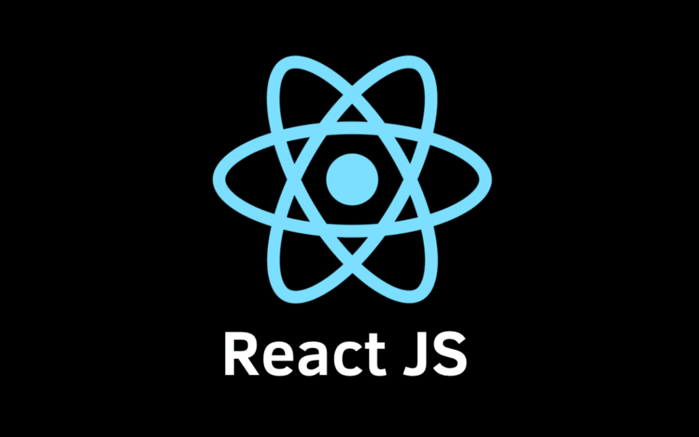

## React intro

## Project Description
The **React Intro** project offers a comprehensive introduction to React, a widely-used JavaScript library for developing user interfaces, especially for single-page applications. It empowers developers to build reusable UI components that manage their state effectively, facilitating efficient updates and rendering of interactive, data-driven applications.

### Key Learning Objectives
- Learn to develop a basic JavaScript application using React.
- Utilize the `create-react-app` package to kickstart React development swiftly.
- Understand JSX and its usage in React development.
- Debug code effectively using React Developer Tools.
- Implement testing with Enzyme's Shadow rendering.
- Integrate React with Webpack & Babel for optimized development workflow.

### Project Tasks
1. **Basic Application**: Setup a basic React application.
2. **Embedding Expressions, Functions**: Embed expressions and functions into React components.
3. **Modify the App**: Make modifications to the main App component.
4. **Modify the Notifications**: Update the Notifications component.
5. **Create Basic Tests**: Implement basic tests with four test cases.
6. **Install Enzyme**: Set up Enzyme for testing.
7. **Create React Tests**: Develop tests for React components.
8. **Deploy to GitHub Pages**: Deploy the project to a GitHub page.
9. **Create Project using Webpack**: Create a project setup using Webpack.
10. **Install Babel**: Integrate Babel for transpilation.
11. **Reorganize Files**: Organize project files for better structure.
12. **Testing**: Continue testing implementation and improvements.

### Author
 [Mouayed sabbagh](https://github.com/MOUAYEDSB)
