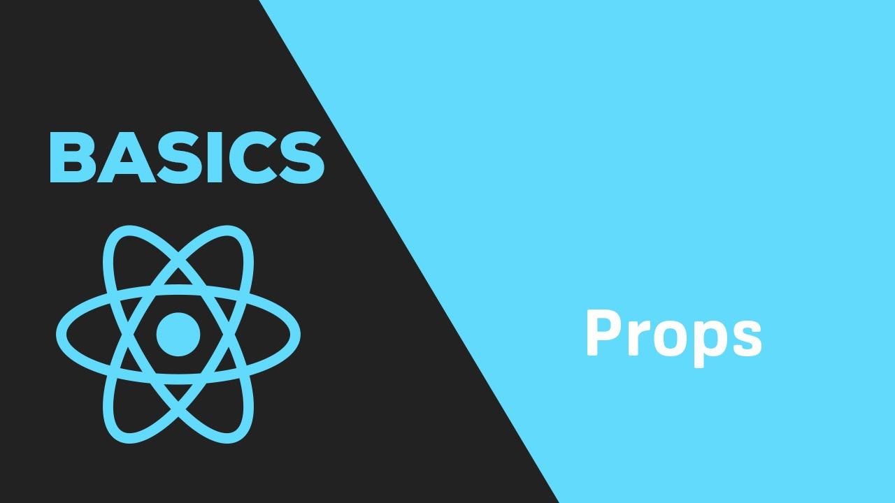

# React Props 

## Introduction
This project demonstrates the basics of React development, focusing on creating and reusing components, passing properties to components, defining types for components, and using Fragments. It also covers the importance of using keys to improve loop performance.

## Learning Objectives
By completing this project, you will gain knowledge in the following areas:
- Creating basic React components using functions
- Reusing components
- Passing properties to components
- Defining types for components
- Using Fragments
- Understanding when to use keys to improve loop performance

## Author ✒️
- [Mouayed sabbagh](https://github.com/MOUAYEDSB)