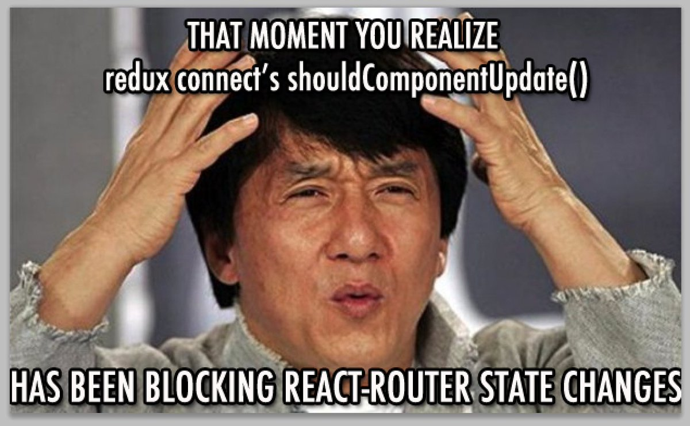

# React Redux Connectors and Providers 💻

## Description 💬

React Redux Connectors and Providers are critical for efficient state management in React applications using Redux. The `Provider` component serves as a bridge, wrapping your entire application to ensure the Redux store is accessible throughout, allowing any nested component to connect with the store effortlessly. Connectors, typically created with the `connect` function from React Redux, enable React components to interact directly with the Redux store. They allow components to read from the state and dispatch actions, making the Redux store’s capabilities seamlessly available to React components. This integration of Redux into React components through connectors not only facilitates a clear separation of concerns but also enhances the maintainability and scalability of your application by ensuring that state management logic is cleanly separated from component rendering logic.

## What We Should Learn from This Project 📑

- **Redux connectors and how to use them**
- The different functions you can pass to a connector (`mapStateToProps`, `mapDispatchToProps`)
- How to map an action creator to a component using a connector
- How to map an async action creator to a component with Redux Thunk
- What Redux Providers are and how to set up your app’s store
- How you can improve a connector’s performance using Reselect
- How to use Redux’s dev tools to debug the state of your application

## Tasks 📚

### 0. Write `mapStateToProps`
Define a `mapStateToProps` function to map state to component props.

### 1. Create a Small Store
Set up a Redux store with basic reducers and initial state.

### 2. Test `mapStateToProps`
Write tests to verify the functionality of your `mapStateToProps` function.

### 3. Update `mapStateToProps`
Modify `mapStateToProps` as needed to handle additional state changes or requirements.

### 4. Connect Your Action Creators
Use `mapDispatchToProps` to connect action creators to your components.

### 5. Refactor Your Code
Refactor your Redux code for better readability and maintainability.

### 6. Update Your Tests
Update your test suites to reflect changes in the Redux setup and component connections.

### 7. Async Actions & Thunk Middleware
Implement async actions using Redux Thunk and connect them to your components.

### 8. Connect `LoginRequest` to the App
Connect the `LoginRequest` action to your App component.

### 9. Connect User State to the Footer
Map user-related state to props and connect it to the Footer component.

### 10. Connect `Logout` Action Creator to the Header
Connect the `Logout` action creator to the Header component.

### 11. Modify the `uiReducer`
Update the `uiReducer` to handle new actions or state changes.

### 12. Modify the Test Suites
Update your tests to accommodate changes in the UI and state management.

### 13. Understand How to Use the Redux Chrome Extension
Learn how to use the Redux DevTools Chrome extension for debugging.

### 14. Combine Store: Root Reducer
Combine multiple reducers into a root reducer and update the store configuration.

### 15. Combine Store: Modify the Application
Update your application to use the combined root reducer.

### 16. Combine Store: Write the Tests
Write tests for the combined store and its reducers.

### 17. Connect Notifications: New Action Creator
Create and connect a new action creator for handling notifications.

### 18. Connect Notifications: Improve Reducer
Enhance the notifications reducer to manage additional states or actions.

### 19. Connect Notifications to the Reducer
Wire up the notifications actions and state to the appropriate components.

### 20. Connect Notifications: Clean Up
Refactor and clean up the notifications logic for clarity and performance.

### 21. Connect Notifications: Update the Test Suites
Update the test suites to cover the notifications functionality.

### 22. Selectors
Define and use selectors to query specific slices of state.

### 23. Connect Courses: Create a Course Selector
Create a selector for managing course-related state.

### 24. Connect Courses: Create a Fetch Courses Function
Develop a function to fetch course data and integrate it with the state.

### 25. Connect the Courses Component
Connect the Courses component to the Redux store and manage its state.

### 26. Memoized Selectors: Redux Reselect
Use Reselect to create memoized selectors for performance improvements.

### 27. Memoized Selectors: Update the UI
Update the UI to use memoized selectors for efficient rendering.

### 28. Memoized Selectors: Update the Test Suite
Adjust the test suite to verify the behavior of memoized selectors.

### 29. Container/Component
Separate concerns by organizing your components into containers and presentational components.

## Author ✒️
- [Mouayed sabbagh](https://github.com/MOUAYEDSB)
